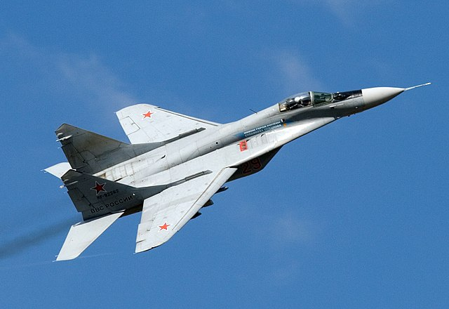
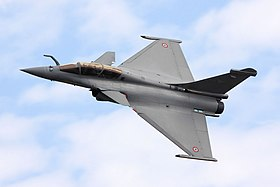

<!DOCTYPE html>
<html lang="fr">
<head>
    <meta charset="UTF-8">
    <meta name="viewport" content="width=device-width, initial-scale=1.0">
    <title>Avions Militaires Modernes</title>
    
</head>
<body>
    <header>
        <h1>Avions Militaires Modernes</h1>
    </header>
    

        

            <h2>F-22 Raptor</h2>
            
            
<strong>Date de premier vol:</strong> 29 septembre 1990

            
<strong>Génération:</strong> 5e génération

            
<strong>Coût de production:</strong> 150 millions USD

            
<strong>Présence dans les armées:</strong> USAF

            
<strong>Vitesse de pointe:</strong> Mach 2.25

            
<strong>Principales caractéristiques:</strong> Stalth, supercroisière, avionique avancée

        

        

            <h2>F-15 Eagle</h2>
            
            
<strong>Date de premier vol:</strong> 27 juillet 1972

            
<strong>Génération:</strong> 4e génération

            
<strong>Coût de production:</strong> 29,9 millions USD

            
<strong>Présence dans les armées:</strong> USAF, JASDF, RSAF, IAF

            
<strong>Vitesse de pointe:</strong> Mach 2.5

            
<strong>Principales caractéristiques:</strong> Manœuvrabilité, avionique avancée

        

        

            <h2>F-16 Fighting Falcon</h2>
            
            
<strong>Date de premier vol:</strong> 20 janvier 1974

            
<strong>Génération:</strong> 4e génération

            
<strong>Coût de production:</strong> 18,8 millions USD

            
<strong>Présence dans les armées:</strong> USAF, IAF, ROKAF, JAF, autres

            
<strong>Vitesse de pointe:</strong> Mach 2.0

            
<strong>Principales caractéristiques:</strong> Polyvalence, avionique avancée

        

        

            <h2>F-35 Lightning II</h2>
            
            
<strong>Date de premier vol:</strong> 15 décembre 2006

            
<strong>Génération:</strong> 5e génération

            
<strong>Coût de production:</strong> 94 millions USD

            
<strong>Présence dans les armées:</strong> USAF, USMC, USN, RAF, RAAF, autres

            
<strong>Vitesse de pointe:</strong> Mach 1.6

            
<strong>Principales caractéristiques:</strong> Stalth, avionique avancée, polyvalence

        

        

            <h2>B-2 Spirit</h2>
            
            
<strong>Date de premier vol:</strong> 17 juillet 1989

            
<strong>Génération:</strong> 4e génération

            
<strong>Coût de production:</strong> 737 millions USD

            
<strong>Présence dans les armées:</strong> USAF

            
<strong>Vitesse de pointe:</strong> Mach 0.95

            
<strong>Principales caractéristiques:</strong> Stalth, charge utile

        

        

            <h2>A-10 Thunderbolt II</h2>
            
            
<strong>Date de premier vol:</strong> 10 mai 1972

            
<strong>Génération:</strong> 4e génération

            
<strong>Coût de production:</strong> 11,8 millions USD

            
<strong>Présence dans les armées:</strong> USAF

            
<strong>Vitesse de pointe:</strong> 706 km/h

            
<strong>Principales caractéristiques:</strong> Résilience, puissance de feu

        

        

            <h2>MiG-15</h2>
            
            
<strong>Date de premier vol:</strong> 30 décembre 1947

            
<strong>Génération:</strong> 1ère génération

            
<strong>Coût de production:</strong> N/A

            
<strong>Présence dans les armées:</strong> VVS, KPAF, PLAAF, autres

            
<strong>Vitesse de pointe:</strong> 1 059 km/h

            
<strong>Principales caractéristiques:</strong> Manœuvrabilité, armement

        

        

            <h2>MiG-21</h2>
            
            
<strong>Date de premier vol:</strong> 14 février 1956

            
<strong>Génération:</strong> 2e génération

            
<strong>Coût de production:</strong> N/A

            
<strong>Présence dans les armées:</strong> VVS, PAF, IAF, autres

            
<strong>Vitesse de pointe:</strong> Mach 2.05

            
<strong>Principales caractéristiques:</strong> Manœuvrabilité, armement

        

        

            <h2>MiG-27</h2>
            
            
<strong>Date de premier vol:</strong> 20 août 1970

            
<strong>Génération:</strong> 3e génération

            
<strong>Coût de production:</strong> N/A

            
<strong>Présence dans les armées:</strong> VVS, IAF, autres

            
<strong>Vitesse de pointe:</strong> Mach 1.7

            
<strong>Principales caractéristiques:</strong> Polyvalence, avionique

        

        

            <h2>MiG-29</h2>
            
            
<strong>Date de premier vol:</strong> 6 octobre 1977

            
<strong>Génération:</strong> 4e génération

            
<strong>Coût de production:</strong> N/A

            
<strong>Présence dans les armées:</strong> VVS, autres

            
<strong>Vitesse de pointe:</strong> Mach 2.25

            
<strong>Principales caractéristiques:</strong> Manœuvrabilité, avionique avancée

    

    <h2>Rafale</h2>
    
    
<strong>Date de premier vol:</strong> 4 juillet 1986

    
<strong>Génération:</strong> 4.5e génération

    
<strong>Coût de production:</strong> 115 millions USD

    
<strong>Présence dans les armées:</strong> Armée de l'Air et de l'Espace, Marine Nationale, IAF, autres

    
<strong>Vitesse de pointe:</strong> Mach 1.8

    
<strong>Principales caractéristiques:</strong> Polyvalence, avionique avancée, capacité de supercroisière

